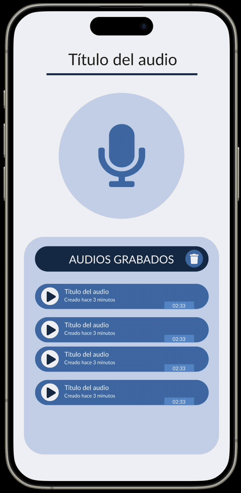
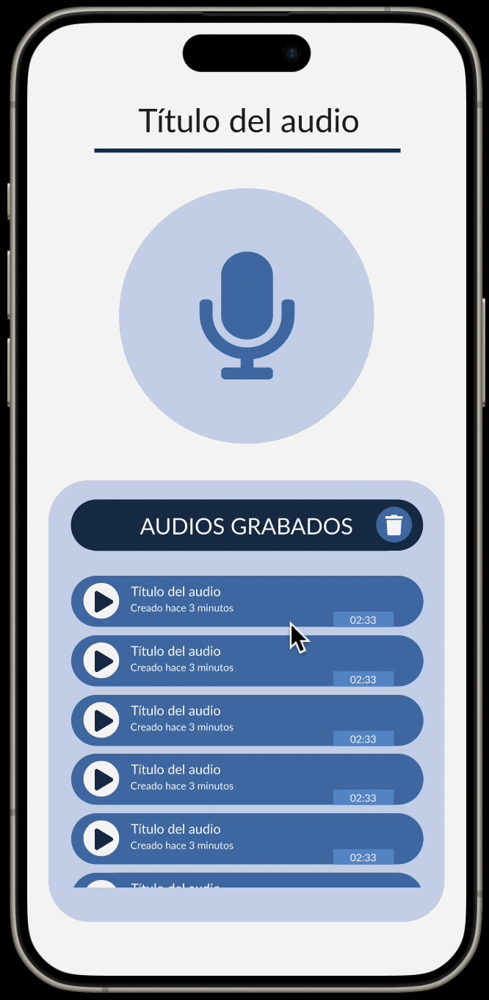

[<- Volver al README.md](../README.md)

# 1. Diseño de la pantalla de grabación

Este documento detalla la resolución técnica y funcional de la pantalla de grabación de audio, integrando controles de captura, feedback visual y gestión de archivos de audio.

>  > _Nota: El prototipo interactivo permite testear la sensibilidad del drag y la fluidez de las transiciones de borrado._

Puedes acceder al proyecto Figma desde el siguiente enlace: https://www.figma.com/design/hDKF4XQIHewGQXb8EyyDEd/Grabadora?node-id=0-1&t=IM8SWczsUiKzyPXN-1

## 1. Elementos de la Interfaz

La interfaz se ha dividido en tres secciones clave para garantizar la usabilidad:

- **Sección de Control (Header/Top):** Contiene el botón principal de acción y el feedback de estado, así como se permite elegir el título con el que guardar el audio.
- **Gestión de Archivos (Bottom Sheet/List):** Listado dinámico de grabaciones con opciones de reproducción y borrado.

---

## 2. Especificaciones de Componentes

### A. Botón de Grabación y Estado Activo

Se implementó un componente con dos estados principales vinculados mediante **Smart Animate**:

- **Estado Reposo:** Icono de micrófono estándar.
- **Estado Grabando:** El icono cambia o se rodea de una **onda expansiva (ripple effect)**.

### B. Listado de Audios (Audio Card)

Cada tarjeta de audio incluye:

- Título del track y metadatos (duración/fecha).
- Botón de **Play/Pause** para reproducción individual.
- Contenedor con **Clip Content** activo para ocultar elementos de gestión lateral.

---

## 3. Interacciones y Prototipado

### Implementación del "Swipe to Delete"

Para la eliminación individual de audios, se aplicó la siguiente lógica de prototipado:

1.  **Activación por Arrastre:** Se configuró un disparador **On Drag** desde la tarjeta en reposo hacia la izquierda.
2.  **Revelación de Herramientas:** Al deslizar, se desplaza la capa superior para revelar el botón de **Eliminar (Papelera)** situado en la capa inferior.
3.  **Confirmación de Borrado:** \* Al hacer clic en la papelera (**On Click**), se transiciona a una variante del componente con `Height: 0px` y `Opacity: 0%`.
    - Gracias al **Auto Layout** del contenedor padre, el resto de la lista sube fluidamente para ocupar el espacio vacío.

### Eliminación Global

- **Botón "Eliminar Todo":** Ubicado en la cabecera del listado (`AUDIOS GRABADOS`).

En el caso de pulsar este icono se mostraría un modal de confirmación antes de eliminar todos los audios grabados:

## 4. Flujo de Usuario

El diseño propuesto para el flujo de usuario es el siguiente:

| Acción                   | Resultado Visual                                       | Animación                   |
| :----------------------- | :----------------------------------------------------- | :-------------------------- |
| **Tap en Micrófono**     | Inicia grabación y aparece el indicador.               | Smart Animate (Ease-in-out) |
| **Tap en Parar**         | El audio se añade automáticamente a la lista inferior. | Move In (desde abajo)       |
| **Slide a la izquierda** | Revela el icono de eliminar de la tarjeta.             | On Drag + Smart Animate     |
| **Tap en Papelera**      | El audio se desvanece y la lista se recompone.         | Smart Animate (300ms)       |

---

[<- Volver al README.md](../README.md)
