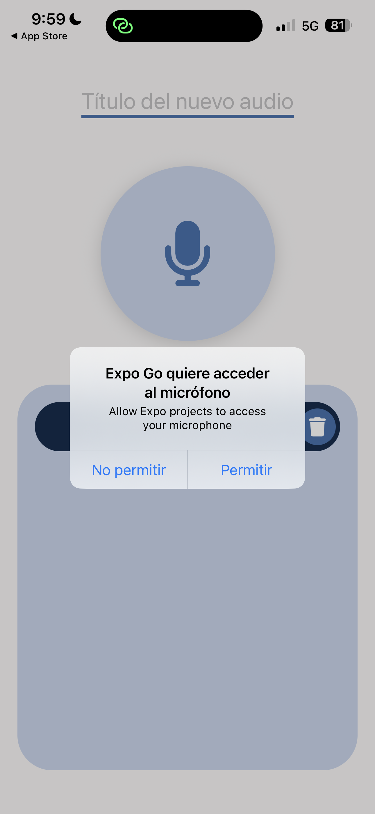
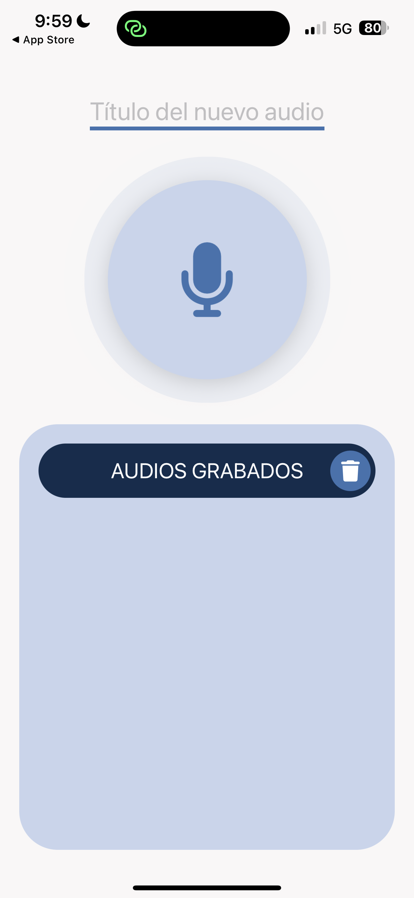
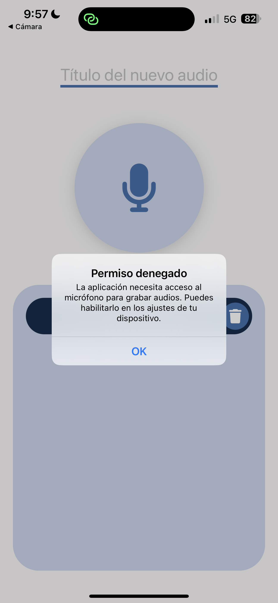

[<- Volver al README.md](../README.md)

# 3. Solicitar Permisos de Grabación

## Resolución del Ejercicio

Para cumplir con el requerimiento de solicitar permisos al usuario antes de iniciar la grabación de un nuevo audio, se ha implementado la validación nativa utilizando el módulo `expo-audio` dentro del componente `RecordButton`.

El sistema asegura que la aplicación nunca intente grabar sin antes haber confirmado explícitamente el consentimiento del usuario.

|                            Solicitando Permiso                             |               Grabando (Concedido)               |                                  Permiso Denegado                                  |
| :------------------------------------------------------------------------: | :----------------------------------------------: | :--------------------------------------------------------------------------------: |
| En esta captura se muestra la solicitud de permiso de grabación al usuario |      Una vez aceptado comienza a grabar...       | Si fue denegado, se informa al usuario de que debe modificar sus ajustes de la app |
|                        |  |                            |

### Lógica de Implementación

La gestión de los permisos se maneja de forma asíncrona a través de la función `handlePress`, que se activa al interactuar con el botón principal del micrófono:

1. **Verificación de Estado Actual:** Se comprueba si la aplicación ya cuenta con los permisos mediante `AudioModule.getRecordingPermissionsAsync()`.
2. **Solicitud Interactiva:** Si el permiso no está otorgado (`status !== "granted"`), se solicita explícitamente al usuario lanzando el prompt nativo del sistema operativo mediante `AudioModule.requestRecordingPermissionsAsync()`.
3. **Manejo de Resultados:**
   - **Permiso Concedido:** Si el usuario acepta (`status === "granted"`), el estado `isRecording` cambia a `true`, lo cual activa las animaciones de ondas expansivas visualizando que el micrófono está activo.
   - **Permiso Denegado:** Si el usuario rechaza la solicitud, se evita el inicio de la grabación y se levanta una alerta (`Alert.alert`) informando de la necesidad del micrófono para usar la funcionalidad y sugiriendo activarlo desde los ajustes del dispositivo.

### Código Destacado

```typescript
const handlePress = async () => {
  if (isRecording) {
    setIsRecording(false);
  } else {
    try {
      // 1. Verificamos el estado actual del permiso
      let permission = await AudioModule.getRecordingPermissionsAsync();

      // 2. Si no lo tenemos, lanzamos la solicitud al usuario
      if (permission.status !== "granted") {
        permission = await AudioModule.requestRecordingPermissionsAsync();
      }

      // 3. Evaluamos la respuesta final
      if (permission.status === "granted") {
        setIsRecording(true); // Activa estado de grabación y animaciones
      } else {
        // Manejo del rechazo de permisos
        Alert.alert(
          "Permiso denegado",
          "La aplicación necesita acceso al micrófono para grabar audios. Puedes habilitarlo en los ajustes de tu dispositivo."
        );
      }
    } catch (error) {
      console.error("Error al gestionar los permisos de audio:", error);
    }
  }
};
```

## Referencias Oficiales

- **Expo Audio - Recording Permissions:** https://docs.expo.dev/versions/latest/sdk/audio/

[<- Volver al README.md](../README.md)
