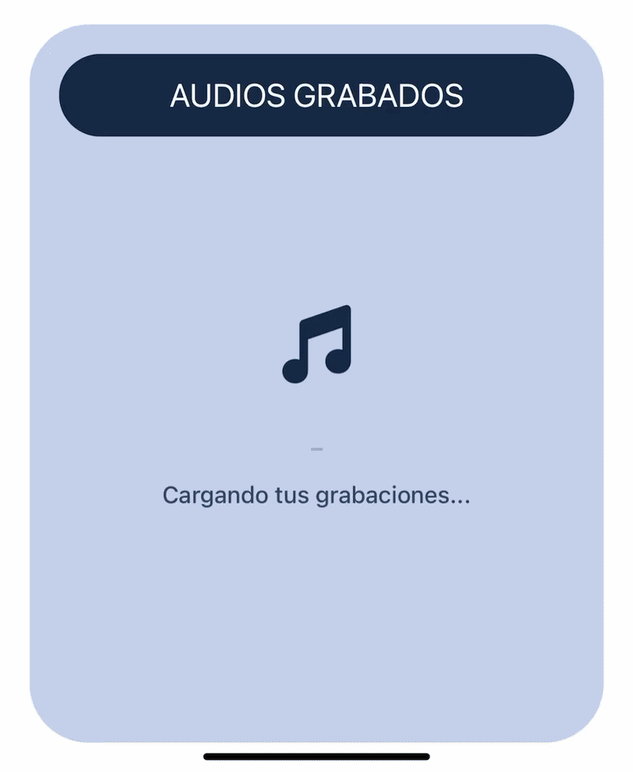

[<- Volver al README.md](../README.md)

# 5. Componente de Carga Personalizado

En este documento se detalla la creación e implementación de un componente de carga (loader) completamente a medida para la aplicación. 

## El Componente: `BouncingNoteLoader`

Se ha creado el componente `BouncingNoteLoader.tsx` utilizando la librería `react-native-reanimated`. Este componente no es un simple bucle, sino que aplica el principio clásico de animación conocido como **"Squash and Stretch" (Estirar y Encoger)**.

### Características Técnicas del Componente:
* **Físicas de Salto:** La nota musical se desplaza en el eje Y (`translateY`), acelerando al caer y desacelerando al llegar a su punto máximo (`Easing.out/in`).
* **Deformación Elástica:** Utilizando `scaleX` y `scaleY`, el icono se estira verticalmente mientras está en el aire y se aplasta horizontalmente al impactar contra el "suelo".
* **Sombra Dinámica:** Cuenta con un componente de sombra en la base cuyo tamaño (`shadowScale`) y opacidad (`shadowOpacity`) reaccionan en tiempo real a la altura de la nota, aportando profundidad (3D simulado).
* **Gestión de Estado Vacío (`isEmpty`):** El componente es reutilizable. Si recibe la prop `isEmpty={true}`, utiliza `cancelAnimation` para detener el salto en seco, devuelve la nota al suelo con una transición suave (`withTiming`), la oscurece a un tono gris y despliega un mensaje indicando que no hay audios.


| Escenario | Screenshot                                          |
|-----------|-----------------------------------------------------|
| **Estado Vacío** |     |
| **Grabación en Progreso** |  |

---

## Implementación A: Carga Inicial y Estado Vacío

El primer punto de integración es la recuperación de audios almacenados al abrir la aplicación. Esta lógica se orquesta desde `App.tsx` y se renderiza en `TrackList.tsx`.

### Lógica de Carga (`App.tsx`):
Se ha implementado un estado `isLoading` que se activa a `true` al iniciar la recuperación de datos mediante `AsyncStorage`. Se ha añadido un pequeño retraso intencionado (`setTimeout` de 800ms) para garantizar que el usuario pueda percibir la animación de carga, dado que la lectura local es casi instantánea.

### Renderizado Condicional (`TrackList.tsx`):
Se han establecido tres estados visuales dentro del listado:
1.  **Cargando (`isLoading === true`):** Muestra el `BouncingNoteLoader` saltando junto al texto "Cargando tus grabaciones...".
2.  **Lista Vacía (`tracks.length === 0`):** Reutiliza el `BouncingNoteLoader` pasándole la prop `isEmpty={true}` para mostrar el "Empty State" (nota estática en gris y mensaje).
3.  **Lista Completa:** Renderiza el `ScrollView` con los `TrackCard`.

---

## Implementación B: Proceso de Grabación

El segundo punto crítico de integración es el feedback visual durante el proceso de captura de audio en el componente `RecordButton.tsx`.

En lugar de colocar un *spinner* genérico al lado del botón, se ha optado por una integración mucho más inmersiva: **reemplazar el icono estático del micrófono por el `BouncingNoteLoader` mientras se está grabando**.

### Funcionamiento:
Cuando el usuario inicia la grabación, el estado `isRecordingUI` cambia a `true`. El botón principal, que ya cuenta con animaciones de ondas expansivas en segundo plano, realiza un renderizado condicional en su interior:

```tsx
{isRecordingUI ? (
    <BouncingNoteLoader size={60} color={COLORS.primary} />
) : (
    <FontAwesome6 name="microphone" size={75} color={COLORS.primary} />
)}
```

Esto genera un efecto visual donde el micrófono cobra vida y "baila" al ritmo de la grabación de audio, ofreciendo al usuario una confirmación clara, original y muy dinámica de que la aplicación está registrando su voz.

## Referencias Oficiales

- **react-native-reanimated - Animations:** https://docs.swmansion.com/react-native-reanimated/docs/fundamentals/getting-started/
- **react-native-reanimated - withRepeat:** https://docs.swmansion.com/react-native-reanimated/docs/2.x/api/animations/withRepeat/
- **react-native-reanimated - withSequence:** https://docs.swmansion.com/react-native-reanimated/docs/animations/withSequence/
- **react-native-reanimated - Easing:** https://docs.swmansion.com/react-native-reanimated/docs/fundamentals/customizing-animation/

[<- Volver al README.md](../README.md)
