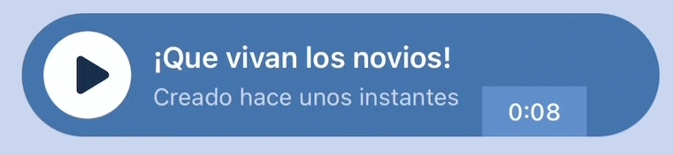

[<- Volver al README.md](../README.md)

# 6. Animación Personalizada (Progreso del Audio)

Para cumplir con el requisito de añadir una animación propia, he decidido implementar un **indicador de progreso visual en las tarjetas de audio (`TrackCard`)**.

En lugar de optar por una simple barra horizontal, he creado una donde un borde de color dibuja el contorno exacto de la tarjeta a medida que el audio avanza, desvaneciéndose elegantemente al finalizar la reproducción.

## Justificación del uso de `react-native-svg`

Inicialmente, se podría pensar en utilizar bordes estándar de React Native (`borderWidth`, `borderColor`). Sin embargo, **las vistas (`View`) nativas no permiten animar el trazado parcial de un borde**, y mucho menos cuando este tiene esquinas redondeadas (`borderRadius`).

Para lograr que una línea fluya perfectamente a través de las curvas del componente, la única solución robusta y profesional es la renderización de gráficos vectoriales. Por ello, se ha integrado la librería `react-native-svg`.

## Detalles de la Implementación Técnica

La construcción de esta animación se divide en cuatro pilares fundamentales:

### 1. Cálculo Dinámico del Perímetro
Para que el SVG sepa exactamente cuánto tiene que dibujar, necesita conocer el tamaño de la tarjeta.
* Se utiliza el evento `onLayout` para capturar el ancho real (`cardWidth`) de la pantalla del dispositivo.
* Con este dato, se calcula matemáticamente el perímetro del rectángulo con bordes redondeados utilizando la fórmula:
  `Perímetro = 2 * (AnchoRecto) + 2 * PI * Radio`

### 2. Animación del Trazado (Stroke Dash)
Se utiliza la técnica de `strokeDasharray` (que define el tamaño de los guiones de la línea, configurado para que coincida con el perímetro total) y `strokeDashoffset` (que define cuánto se desplaza la línea).
A través del hook `useAnimatedProps`, modificamos el `strokeDashoffset` en tiempo real. Cuando el audio empieza, el offset es igual al perímetro (línea invisible). A medida que avanza, el offset se reduce a 0 (línea completamente dibujada).

### 3. Sincronización con la Reproducción de Audio
Se ha integrado un `setInterval` que consulta el estado del `useAudioPlayer` cada 200 milisegundos.
Se calcula el progreso normalizado (de 0 a 1) dividiendo el tiempo actual (`currentTime`) entre la duración total (`duration`). Este valor alimenta una variable compartida (`useSharedValue`) interpolada con `withTiming`, lo que suaviza el movimiento del borde entre las comprobaciones del intervalo.

### 4. Efecto de "Fade Out" al Finalizar
Para pulir la experiencia de usuario (UX), se ha añadido un valor compartido adicional (`borderOpacity`). Cuando el progreso del audio supera el 99% (`currentProgress > 0.99`), se dispara una animación de opacidad que desvanece el borde suavemente (`duration: 600ms`), devolviendo la tarjeta a su estado original de reposo sin cortes bruscos. Al volver a darle al "Play", el borde reaparece rápidamente con un "Fade In" de 300ms.

[<- Volver al README.md](../README.md)
